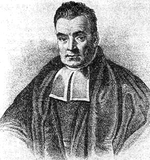

```{r setup, include=FALSE}
knitr::opts_chunk$set(echo = TRUE)
```

## First model in JAGS

Petr Keil

October 2023



## Install and load JAGS

**JAGS:**

- Ubuntu: ```sudo apt install jags```
- Windows: download the installer from SourceForge
- MacOS: ?

Install the main R interface: ```install.packages("R2jags")```

Load the library:

```{r, message = FALSE, warning = FALSE}
library(R2jags)
```

## JAGS - preparing the data

*Pandivirilia eximia* (Meigen 1820), family *Therevidae*


## JAGS - preparing the data


Our data are **counts of larvae** sampled from underneath 
logs in a temperate primeval forest.

## JAGS - preparing the data

```{r}
y <- c(23,17,25,28,38,18,32,51,
       32,41,51,33,21,52,11,19)
N <- length(y)

my.data <- list(y=y, N=N)
my.data
```

## Bayes rule and the JAGS syntax

 
$$p(\theta|y) = \frac {p(\theta) \times p(y|\theta)}{p(y)}$$

where $\theta$ are model parameters, and $y$ are the data

$p(y|\theta)$ ... likelihood

$p(\theta)$ ... prior

$p(\theta|y)$ ... posterior

$p(y)$ ... the horrible thing


## JAGS - model specification

This is the model that we will fit:
$y_i \sim Poisson(\lambda)$

```
model
{
  # p(lambda) 
  
  # p(y|lambda)
  
}
```

## JAGS - model specification

This is the model that we will fit:
$y_i \sim Poisson(\lambda)$

```
model
{
  # p(lambda) ... prior
  
  # p(y|lambda) ... likelihood
  
}
```

## JAGS - model specification

This is the model that we will fit:
$y_i \sim Poisson(\lambda)$

```
model
{
  # prior
    lambda ~ dunif(0, 100)

  # likelihood
    for(i in 1:N)
    {
      y[i] ~ dpois(lambda)    
    }
}
```

## JAGS - model specification

We will dump the model to a file using ```cat("", file="")```

```{r}
cat("
model
{
  # prior
    lambda ~ dunif(0, 100)

  # likelihood
    for(i in 1:N)
    {
      y[i] ~ dpois(lambda)    
    }
}
", file="my_model.txt")
```

## JAGS - model specification

```{r, tidy=FALSE, message = FALSE, warning=FALSE}
fitted.model <- jags(data=my.data,  
                     model.file="my_model.txt", 
                     parameters.to.save="lambda", 
                     n.chains=3, n.iter=2000, n.burnin=1000)
```

## JAGS - exploring the model

```{r}
  plot(as.mcmc(fitted.model))
```

## JAGS - exploring the model

```{r}
  fitted.model
```

## JAGS - exploring the model

```{r}
  plot(as.mcmc(fitted.model))
```

## JAGS - exploring the model with ```ggplot```

```{r, message = FALSE, warning = FALSE}
  library(ggmcmc)
```

## JAGS - exploring the model with ```ggplot```

```{r}
  ggs_density(ggs(as.mcmc(fitted.model)))
```

## JAGS - exploring the model with ```ggplot```

```{r}
  ggs_caterpillar(ggs(as.mcmc(fitted.model)))
```


