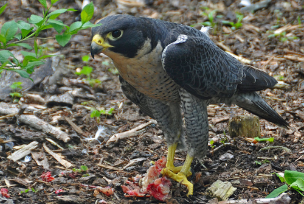

***

# Objective

Here we will implement a Bayesian version of the classical T-test. We will also explore some ways to **summarize the JAGS output**, and we will introduce the concept of **derived quantity**.

***

# The data


We will use the example from **Marc Kery's Introduction to WinBUGS for Ecologists**, page 92 (Section 7.1 - t-test). The data describe wingspan of male and female [Peregrine falcon](https://en.wikipedia.org/wiki/Peregrine_falcon) (*Falco peregrinus*).



***

Let's load the data:


```r
falcon <- read.csv("https://raw.githubusercontent.com/petrkeil/ML_and_Bayes_2021_CZU/main/08_T-test/falcon.csv")
```

And explore the data a bit:


```r
summary(falcon)
boxplot(wingspan ~ male, data=falcon, 
        names=c("Female", "Male"),
        ylab="Wingspan [cm]",
        col="grey")
```

***

# t-test: The classical frequentist solution in R

We can use the classical two-sample ```t.test()```: 

```r
x <- falcon$wingspan[falcon$male==1]
y <- falcon$wingspan[falcon$male==0]
t.test(x, y)
```

**Note:** this can also be done by ```lm()```:

```r
lm1 <- lm(wingspan ~ male, data=falcon)
summary(lm1)
```

... or by ```glm()```:

```r
glm1 <- glm(wingspan ~ male, data=falcon)
summary(glm1)
```

***

# t-test: The 'didactic' solution in JAGS

We assume the each males and females each have their own Normal distribution, from which the wingspans are drawn:

$y_m \sim Normal(\mu_m, \sigma)$

$y_f \sim Normal(\mu_f, \sigma)$

Note that the variance ($\sigma$) is the same in both groups.

This is the hypothesis that we usually test in the frequentist setting:
$\delta = \mu_f - \mu_m \neq 0$

But we can actually ask even more directly: **What is the mean difference ($\delta$) between female and male wingspan?**

***

Here is how we prepare the data for JAGS:

```r
y.male <- falcon$wingspan[falcon$male==1]
y.female <- falcon$wingspan[falcon$male==0]
falcon.data.1 <- list(y.f=y.female,
                      N.f=60,
                      y.m=y.male,
                      N.m=40)
```

Loading the necessary library:

```r
library(R2jags)
```

Definition of the model:

```r
cat("
model
{
  # priors
    mu.f ~ dnorm(0, 0.001) 
    mu.m ~ dnorm(0, 0.001)
    tau <- 1/(sigma*sigma)   ## Note: tau = 'precision' = 1/variance
    sigma ~ dunif(0,100)
  
  # likelihood - Females
    for(i in 1:N.f)
    {
      y.f[i] ~ dnorm(mu.f, tau)
    }
  
  # likelihood - Males
    for(j in 1:N.m)
    {
      y.m[j] ~ dnorm(mu.m, tau)
    }

  # derived quantity:
    delta <- mu.f - mu.m

}    
", file="t-test.bug")
```

The MCMC sampling done by ```jags()``` function:

```r
model.fit <- jags(data=falcon.data.1, 
                  model.file="t-test.bug",
                  parameters.to.save=c("mu.f", "mu.m", "sigma", "delta"),
                  n.chains=3,
                  n.iter=2000,
                  n.burnin=1000,
                  DIC=FALSE)
```

And we can explore the posterior distributions:


```r
model.fit
plot(model.fit)
summary(model.fit)
summary(as.mcmc(model.fit))
plot(as.mcmc(model.fit))
```

## Alternative ways to run and plot the model (optinal)

You can also explore an alternative call with ```run.jags()``` function from package ```runjags```.


```r
library(runjags)

model.fit <- run.jags(data=falcon.data.1, 
                      model="t-test.bug",
                      monitor=c("mu.f", "mu.m", "sigma", "delta"),
                      n.chains=3,
                      sample=1000,
                      burnin=1000)
```


```r
plot(model.fit, plot.type="histogram")
```

You can also try a fancy plotting using ```mcmcplots``` package:


```r
library(mcmcplots)

caterplot(model.fit)
denplot(model.fit)
```

And you can try to get **High Density Intervals** for parameter estimates using
library `HDInterval`:


```r
library(HDInterval)

?hdi
hdi(model.fit, credMass=0.95)
```

***

# t-test: The 'conventional' solution in JAGS

Alternativelly, you can also specify the model in a more conventional way:

$\mu_i = \mu_f + \delta \times male_i$

$y_i \sim Normal(\mu_i, \sigma)$

**Tip**: For different ways to write the same model see Gelman & Hill (2007) *Data analysis using regression and multilevel/hierarchical models*, **page 262**.

***

Preparing the data for JAGS is somewhat different than above:

```r
falcon.data.2 <- list(y=falcon$wingspan,
                      male=falcon$male,
                      N=100)
```

Definition of the model:

```r
cat("
model
{
  # priors
    mu.f ~ dnorm(0, 0.001)
    delta ~ dnorm(0, 0.001)
    tau <- 1/(sigma*sigma)
    sigma ~ dunif(0,100)
    
  # likelihood
    for(i in 1:N)
    {
      y[i] ~ dnorm(mu[i], tau)
      mu[i] <- mu.f + delta*male[i]
    }

  # derived quantity
    mu.m <- mu.f + delta
}    
", file="t-test2.bug")
```

The MCMC sampling done by ```jags()``` function:

```r
model.fit <- jags(data=falcon.data.2, 
                  model.file="t-test2.bug",
                  parameters.to.save=c("mu.f", "mu.m", "sigma", "delta"),
                  n.chains=3,
                  n.iter=2000,
                  n.burnin=1000,
                  DIC=FALSE)
```

And we can explore the posterior distributions:


```r
model.fit
plot(model.fit)
summary(model.fit)
summary(as.mcmc(model.fit))
plot(as.mcmc(model.fit))
```


