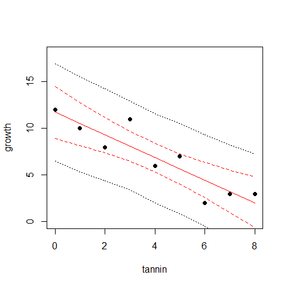

***

# Objective

Here we will do classical linear regression in a Bayesian setting. We will also show the difference between **credible intervals** of parameters and  **prediction intervals** of predictions.

In **Part 1** the data and the model are introduced. Participants then try to implement the model in BUGS. In **Part 2** the solution is exposed, and the difference between credible and prediction intervals is explained.

***

# The data


```r
  catepil <- read.csv("https://rawgit.com/petrkeil/ML_and_Bayes_2017_iDiv/master/Linear%20Regression/catepilar_data.csv")
  catepil
```

```
##   growth tannin
## 1     12      0
## 2     10      1
## 3      8      2
## 4     11      3
## 5      6      4
## 6      7      5
## 7      2      6
## 8      3      7
## 9      3      8
```

# Preparing the data for JAGS

We will put all of our data in a list object


```r
linreg.data <- list(N=9,
                    tannin=catepil$tannin,
                    growth=catepil$growth)
linreg.data
```

```
## $N
## [1] 9
## 
## $tannin
## [1] 0 1 2 3 4 5 6 7 8
## 
## $growth
## [1] 12 10  8 11  6  7  2  3  3
```

# Fitting the model by MCMC in JAGS

The R library that connects R with JAGS:


```r
library(R2jags)
```

This is the JAGS definition of the model:


```r
cat("
  model
  {
    # priors
    a ~ dnorm(0, 0.001) # intercept
    b ~ dnorm(0, 0.001) # slope
    sigma ~ dunif(0, 100) # standard deviation
  
    tau <- 1/(sigma*sigma) # precision
    
   # likelihood
   for(i in 1:N)
   {
    growth[i] ~ dnorm(mu[i], tau)
    mu[i] <- a + b*tannin[i]
   }
  }
", file="linreg_model.bug")
```

The MCMC sampling done by ```jags``` function:


```r
model.fit <- jags(data=linreg.data, 
               model.file="linreg_model.bug",
               parameters.to.save=c("a", "b", "sigma"),
               n.chains=3,
               n.iter=2000,
               n.burnin=1000)
```

```
## Compiling model graph
##    Resolving undeclared variables
##    Allocating nodes
## Graph information:
##    Observed stochastic nodes: 9
##    Unobserved stochastic nodes: 3
##    Total graph size: 46
## 
## Initializing model
```

And we can examine the results:


```r
model.fit
plot(as.mcmc(model.fit))
```

# Bayesian predictions using MCMC

**Beware:** Here we will use library ```rjags``` that gives more control over the MCMC (as opposed to ```R2jags```):


```r
library(rjags)

cat("
  model
  {
    # priors
    a ~ dnorm(0, 0.001)
    b ~ dnorm(0, 0.001)
    sigma ~ dunif(0, 100)
  
    tau <- 1/(sigma*sigma)
    
    # likelihood
   for(i in 1:N)
   {
    growth[i] ~ dnorm(mu[i], tau)
    mu[i] <- a + b*tannin[i]
   }
  
   # predictions
   for(i in 1:N)
   {
    prediction[i] ~ dnorm(mu[i], tau) 
   }
  }
", file="linreg_model.bug")
```

Initializing the model:


```r
jm <- jags.model(data=linreg.data, 
                 file="linreg_model.bug",
                 n.chains = 3, n.adapt=1000)
```

```
## Compiling model graph
##    Resolving undeclared variables
##    Allocating nodes
## Graph information:
##    Observed stochastic nodes: 9
##    Unobserved stochastic nodes: 12
##    Total graph size: 55
## 
## Initializing model
```

The burn-in phase:


```r
update(jm, n.iter=1000)
```

We will monitor the predicted values:


```r
params <- c("prediction")
samps <- coda.samples(jm, params, n.iter=5000)     
predictions <- summary(samps)$quantiles
```

And here we will monitor the expected values:


```r
params <- c("mu")
samps <- coda.samples(jm, params, n.iter=5000)     
mu <- summary(samps)$quantiles
```

Plotting the predictions:


```r
plot(c(0,8), c(0,18), type="n", xlab="tannin", ylab="growth")
points(catepil$tannin, catepil$growth, pch=19)
lines(catepil$tannin, mu[,"50%"], col="red")
lines(catepil$tannin, mu[,"2.5%"], col="red", lty=2)
lines(catepil$tannin, mu[,"97.5%"], col="red", lty=2)
lines(catepil$tannin, predictions[,"2.5%"], lty=3)
lines(catepil$tannin, predictions[,"97.5%"], lty=3)
```

<!-- -->

The figure shows the **median expected value** (solid red), **95% credible intervals of the expected value** (dashed red) and **95% prediction intervals** (dotted). 


