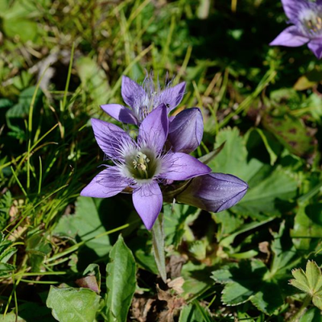
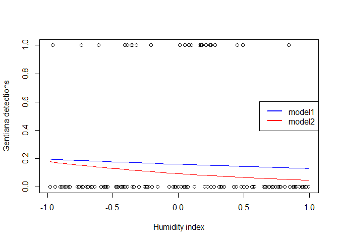
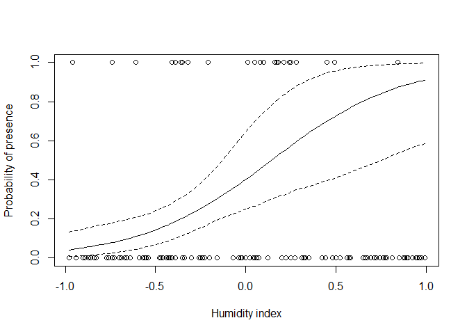
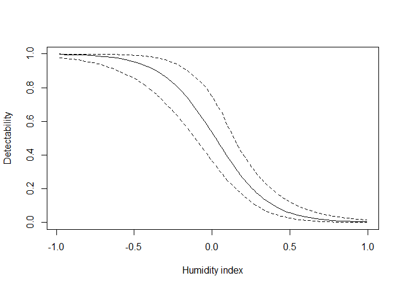

***

# Objective

Here we will go through a simple hierarchical model of species occupancy that
accounts for imperfect detectability of a species. The main aims are (1) to show a variant of **binomial-family regression**, (2) to demonstrate
hierarchical models with **observation and process components**, and (3) to introduce
the concept of **latent variables**.

***

# The Data

We will work with **Marc Kery's data from chapter 20** of his Introduction to WinBUGS for ecologists.
The data describe detections of *Gentianella germanica* at 150 sites, each visited 3 times. We wish to estimate the relationship between $P$ of occurence, and a humidity index. However, we also know that the detectability of the species depends on humidity itself.




Loading the data from the web:

```r
  gentiana <- read.csv("https://raw.githubusercontent.com/petrkeil/ML_and_Bayes_2021_CZU/main/11_Site-occupancy_model/gentiana.csv")
```

Explore the data a little bit:

```r
head(gentiana)
```

```
##   humidity visit1 visit2 visit3 pres.abs
## 1    -0.98      0      0      0        0
## 2    -0.96      1      1      1        1
## 3    -0.94      0      0      0        0
## 4    -0.94      0      0      0        0
## 5    -0.90      0      0      0        0
## 6    -0.89      0      0      0        0
```

```r
nrow(gentiana)
```

```
## [1] 150
```

***

# "Naive" analysis by GLM

This is the classical LOGISTIC REGRESSION for presence-absence data:

```r
  naive.m1 <- glm(pres.abs~humidity, data=gentiana, family="binomial")
```

Or the response can be number of successes out of 3 visits:

```r
  succ.fail <- cbind(rowSums(gentiana[,2:4]), 3 - rowSums(gentiana[,2:4]))
  naive.m2 <- glm(succ.fail~humidity, data=gentiana, family="binomial")
```

Plotting the data and the predictions of the two naive models:

```r
  plot(gentiana$humidity, gentiana$pres.abs,
       xlab="Humidity index", ylab="Gentiana detections")
  lines(gentiana$humidity, predict(naive.m1, type="response"), col="blue")
  lines(gentiana$humidity, predict(naive.m2, type="response"), col="red")
  legend("right", lwd=c(2,2), col=c("blue","red"),
         legend=c("model1","model2"))
```

<!-- -->

***

# Bayesian model with imperfect detection

## Model definition

$z_i \sim Bernoulli(\psi_i)$

$y_{ij} \sim Bernoulli(z_i \times p_{i})$

Where $z_i$ is the unobserved but true occurrence, $\psi_i$ is probability of occurrence, $y_{ij}$ is the detection or non-detection (the actual data) at site $i$ during visit $j$, and $p_{i}$ is the detection probability of the species.

We also know that

$p_{i}=f(humidity_{i})$

and that

$\psi_i=f(humidity_i)$


## Fitting the model in JAGS

Let's prepare the data for JAGS:

```r
  # just make the 2D array as simple as possible
  y <- as.matrix(gentiana[,2:4])
  colnames(y) <- NULL

  gentiana.data <- list(N.sites = nrow(y),
                        N.visit = ncol(y),
                        humidity = gentiana$humidity,
                        y = y)
```

Our favourite library:

```r
  library(R2jags)
```

The model:

```r
  cat("
    model
    {
    # PRIORS ----------------------------------
    
      alpha.occ ~ dnorm(0, 0.01)
      beta.occ ~ dnorm(0, 0.01)
      alpha.det ~ dnorm(0, 0.01)
      beta.det ~ dnorm(0, 0.01)
      
    # LIKELIHOOD ------------------------------
    
    for(i in 1:N.sites)
    {
      # TRUE OCCUPANCY at site i:
      logit(psi[i]) <- alpha.occ + beta.occ*humidity[i] 
      z[i] ~ dbern(psi[i]) 
      
      # DETECTION PROBABILITY:
      logit(p[i]) <- alpha.det + beta.det*humidity[i] 

      # effective probability of observing the present individual
      eff.p[i] <- z[i] * p[i] 
      
      for(j in 1:N.visit)
      {           
         # the observed data -- detection/non-detection at [i,j]
         y[i,j] ~ dbern(eff.p[i]) 
      }  
    }
    }
  ", file="gentiana.txt")
```
  
**Initial values are really important for models with latent variables!** You have to specify them, otherwise it won't work.

```r
  zst <- apply(X=y, MARGIN=1, FUN=max)
  
  inits <- function(){list(z=zst, alpha.occ=rnorm(1),
                      beta.occ=rnorm(1),
                      alpha.det=rnorm(1),
                      beta.det=rnorm(1))}
```

Now we can run the model and monitor the parameter $\psi$ (the actual 
probability of presence):

```r
  model.fit <- jags(data=gentiana.data, 
                    model.file="gentiana.txt",
                    parameters.to.save=c("psi"),
                    n.chains=1,
                    n.iter=2000,
                    n.burnin=1000,
                    inits=inits, 
                    DIC=FALSE)
```

```
## module glm loaded
```

```
## module dic loaded
```

```
## Compiling model graph
##    Resolving undeclared variables
##    Allocating nodes
## Graph information:
##    Observed stochastic nodes: 450
##    Unobserved stochastic nodes: 154
##    Total graph size: 1538
## 
## Initializing model
```

## Plotting the results

Let's plot data together with the expected value and its credible intervals:

```r
plot(gentiana$humidity, gentiana$pres.abs,
       xlab="Humidity index", ylab="Probability of presence")
lines(gentiana$humidity, model.fit$BUGSoutput$summary[,'50%'])
lines(gentiana$humidity, model.fit$BUGSoutput$summary[,'2.5%'], lty=2)
lines(gentiana$humidity, model.fit$BUGSoutput$summary[,'97.5%'], lty=2)
```

<!-- -->

And let's pull out the **detectability**:

Now we can run the model:

```r
  model.fit <- jags(data=gentiana.data, 
                 model.file="gentiana.txt",
                 parameters.to.save=c("p"),
                 n.chains=1,
                 n.iter=2000,
                 n.burnin=1000,
                 inits=inits, 
                 DIC=FALSE)
```

```
## Compiling model graph
##    Resolving undeclared variables
##    Allocating nodes
## Graph information:
##    Observed stochastic nodes: 450
##    Unobserved stochastic nodes: 154
##    Total graph size: 1538
## 
## Initializing model
```

```r
plot(gentiana$humidity, gentiana$pres.abs,
       xlab="Humidity index", ylab="Detectability", type="n")
lines(gentiana$humidity, model.fit$BUGSoutput$summary[1:150,'50%'])
lines(gentiana$humidity, model.fit$BUGSoutput$summary[1:150,'2.5%'], lty=2)
lines(gentiana$humidity, model.fit$BUGSoutput$summary[1:150,'97.5%'], lty=2)
```

<!-- -->


