```{r setup, include=FALSE}
knitr::opts_chunk$set(echo = TRUE)
```

## Software

**OpenBUGS** [www.openbugs.net](http://openbugs.net/w/FrontPage)

- Successor of (now discontinued) WinBUGS.
- Made Bayesian analysis popular.
- Has a GUI or can be commanded from **R**.
- Great example models.
- Useful for **spatial analysis**.
- Difficult to debug, somewhat unpredictable.

**R packages for OpenBUGS**

- ```BRugs``` - gives full control over OpenBUGS
- ```R2OpenBUGS``` - simpler and more user-friendly

## Software

**JAGS** [mcmc-jags.sourceforge.net/](http://mcmc-jags.sourceforge.net/)

- Just Another Gibbs Sampler.
- Uses the BUGS language (almost identical to OpenBUGS).
- Reliable, cross-platform.
- Can be commanded from within **R**.

**R packages for JAGS**

- ```rjags ``` - gives full control over JAGS
- ```R2jags``` - simpler and more user-friendly
- ```runjags``` - simple, parallel-friendly

## Software

**Nimble** [https://r-nimble.org/](https://r-nimble.org/)

- Uses BUGS language (same as JAGS, OpenBUGS)
- relatively new, reportedly great

**R packages for Nimble**

- ```nimble``` - the base Nimble package
- ```nimbleHMC``` - uses Hamiltonian Monte Carlo

## Software

**STAN** - [mc-stan.org](http://mc-stan.org)

- The newest one.
- Can be commanded from **R**, **Python** or Linux shell.
- Does not use the BUGS language, but the code is similar.
- Slightly more alien, sometimes more flexible, 
sometimes better mixing, sometimes faster,
sometimes not.

**R packages for STAN**

- ```rstan```
- ```brms``` - can fit Bayesian models using classical 'glm' 
model formulas and STAN

## Software

```{r}
  catepil <- read.csv("https://cutt.ly/1mp5Dc0")
  catepil
```


## Software


```{r}
# library(brms)

# stan.model <- brm(growth ~ tannin, 
#                   data = catepil, 
#                   family = gaussian())
```


## Software

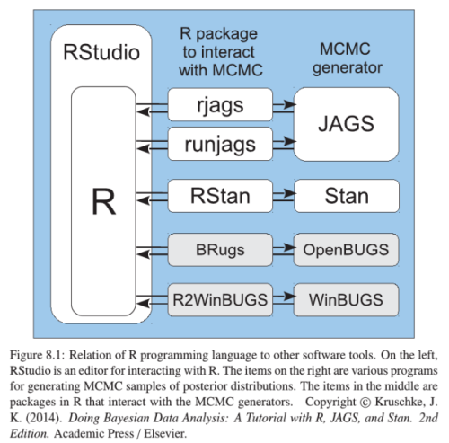

## Software

**INLA** - [www.r-inla.org](http://www.r-inla.org)

- Integrated Nested Laplace Approximation
- Very fast
- Whole different universe -- not treated in this course.
- Not as flexible as MCMC (yet?).

**R packages for INLA**
- ```RINLA```

## Software

**Other useful R packages** - [see the CTAN taskview](http://cran.r-project.org/web/views/Bayesian.html)

- ```coda``` -- handles and summarizes MCMC chains
- ```HDInterval``` --  High Density Intervals
- ```MCMCglmm``` -- simple Bayesian GLM
- ```spBayes``` and ```geoRglm``` -- spatially explicit modelling
- ```hSDM``` -- Hierarchical Species Distribution Modelling
- ```ggmcmc``` -- pretty output visualization in ```ggplot2``` style


## On-line resources

- [The CTAN taskview](http://cran.r-project.org/web/views/Bayesian.html) - essential R packages.
- [Andrew Gelman](http://andrewgelman.com/)'s blog.
- [Richard McElreath](https://xcelab.net/rm/statistical-rethinking/)'s webpage
- [J.M. White's tutorial](http://www.johnmyleswhite.com/notebook/2010/08/20/using-jags-in-r-with-the-rjags-package/) on setting up R & JAGS.
- N.T. Hobbs' [An ecological modeler's primer on JAGS](http://hydrodictyon.eeb.uconn.edu/people/cmerow/home/teaching_files/Short_Course/A_Primer_on_JAGS_for_Ecological_Modelers_III1.pdf)
- Ben Bolker's [Ecological Models and Data in R](http://ms.mcmaster.ca/~bolker/emdbook/) - free manuscript.
- User manuals for [OpenBUGS](http://www.openbugs.net/w/Documentation), [JAGS](http://people.math.aau.dk/~kkb/Undervisning/Bayes14/sorenh/docs/jags_user_manual.pdf) and [STAN](http://mc-stan.org/manual.html)
- [R-bloggers](http://www.r-bloggers.com/) and [Cross Validated](http://stats.stackexchange.com/).


## Books

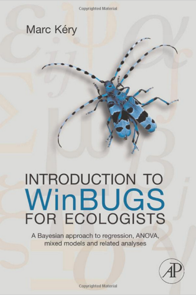

## Books

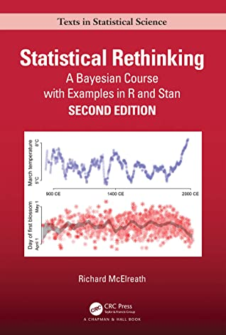

## Books

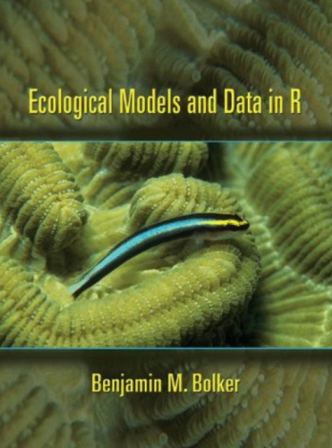

## Books

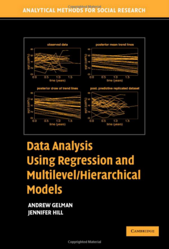


## Books

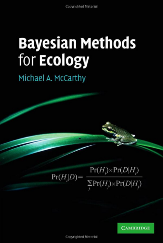


## Books

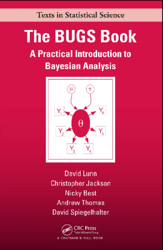

## Books

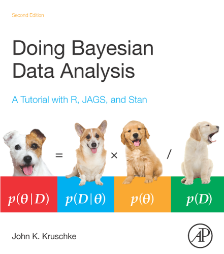

## Books

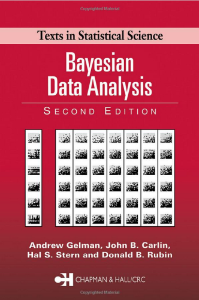

## Books

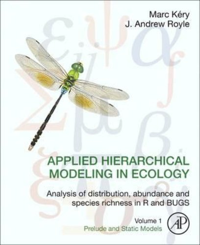

## Books

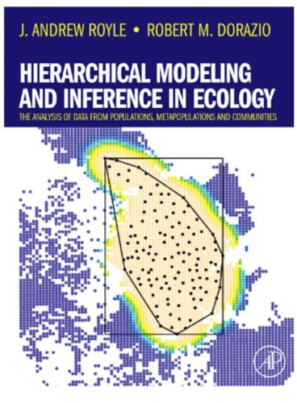
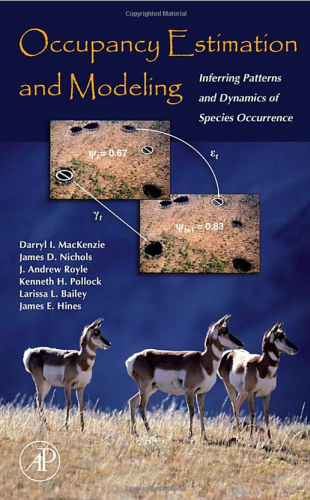


